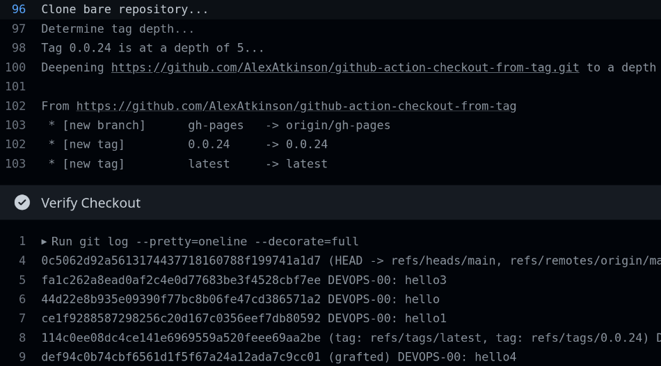
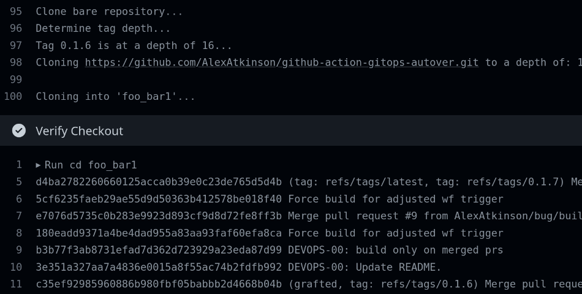

# Introduction

<!-- https://github.com/marketplace/actions/count-action-users -->

Unlike other clone/checkout actions, this action _automatically_ detects the depth of a specified tag or commit hash, and clones the specified repo from that depth.

While the shallow clone is often the answer when handling large repos with a lot of history, there are often times when it would be beneficial to be able to clone from 'origin/HEAD' back to a specific tag or commit hash. 
Such scenarios have been countered several times through the years as the bones behind the [GitOps Automatic Versioning](https://github.com/marketplace/actions/gitops-automatic-versioning) Action were hardening. With the release of that action, the scope of this impediment across it's potential userbase and it's associated cost(s) became well worth mitigating.

> NOTE: The GitOps Automatic Versioning action will receive this update in a future release (post 0.1.7).

No, there is no git option to clone a repo _after_, or _between_ specified commits. You must know the depth before specifying it.

## Usage

The default behavior of this action is similar to that of 'actions/checkout', except that this action will automatically detect the last semver tag and clone from there to 'origin/HEAD'.

This behavior can be overridden with the following options.

### Inputs

<dl>
  <dt>tag: [string] (Optional)</dt>
    <dd>The tag or commit hash to clone from. 
    When NOT supplied this action attempts to detect the last semver tag for the repo.
    </dd>
  <dt>repo: [string] (Optional)</dt>
    <dd>The repository to clone. 
    Specify to clone a different repository. 
    Default: The user action repository.
    </dd>
  <dt>ssh-token: [string] (Optional/Required)</dt>
    <dd>The <a href="https://docs.github.com/en/developers/overview/managing-deploy-keys#deploy-keys">deploy</a>/<a href="https://docs.github.com/en/developers/overview/managing-deploy-keys#machine-users">machine</a> token for a private repository. 
    Required if cloning a 3rd party private repo. 
    WARN: Supply as a <a href="https://docs.github.com/en/actions/using-workflows/workflow-syntax-for-github-actions#example-using-secrets">secret</a>. 
    WARN: This is untested... atm.
    </dd>
  <dt>dir: [string] (Optional/Required)</dt>
    <dd>The directory into which to clone the repository. 
    When supplied, the target dir is '$GITHUB_WORKSPACE/$dir'. 
    The directory must either not exist, or be empty. 
    Required if cloning a different repo. 
    Default: $GITHUB_WORKSPACE
    </dd>
</dl>

### Example GH Action Workflow

This is a valid workflow utilizing this action.

    name: Validate Checkout From Tag

    on:
      workflow_dispatch:

    jobs:
      use-action:
        name: Checkout From Tag
        runs-on: ubuntu-latest
        steps:
        - name: Checkout github-actions-gitops-autover to the depth of tag 0.1.6
          uses: AlexAtkinson/github-action-checkout-from-tag@latest
          with:
            repo: https://github.com/AlexAtkinson/github-action-gitops-autover.git
            tag: 0.1.6
            dir: foo_bar
        - name: Verify Checkout
          run: |
            cd foo_bar
            git log --tags --pretty=oneline --decorate=full

### Results

#### Deepen Current Repo

#### Clone a Different Repo to Depth of Tag...

## Code Logic

For those interested, here's some pseudo code:

    1. Clone only the administrative files to get access to the full git log.
    2. Count the commits between the specified tag/commit and origin/HEAD to determine the depth.
    3. Clone the repo to the detected depth.

## [Known|Non]-Issues

None yet.

## Future Enhancements

PR's welcome...
